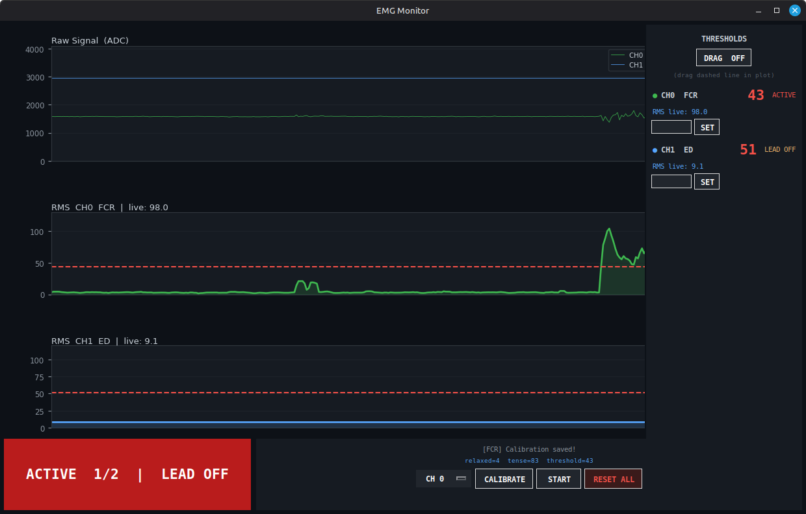

# AD8232 EMG — ESP32-C5 WROOM + OTA


-0f766e)


## Safety

> [!NOTE]
> Use OTA for normal firmware updates whenever possible. Avoid connecting the EMG setup directly to a PC over USB while it is attached to the body, because ground faults, wiring mistakes, or accidental shorts can create an unnecessary safety risk. Use USB only for the initial flash and prefer battery-powered operation during measurements.

Modular multi-channel surface EMG using one or more AD8232 modules and an
ESP32-C5 WROOM. Channel count, pin assignment and labels are defined in a single
table in `firmware/emg_ota/config.h` — add a row to add a channel; the API
and GUI pick up the new layout automatically. Data streams over WiFi to a
Python GUI. The ESP32-C5 WROOM runs on a USB powerbank; flashing is done wirelessly
via OTA after the first USB flash.

See also: [Roadmap](docs/ROADMAP.md) · [Single-Channel EMG Guide](docs/SINGLE_CHANNEL_EMG_PLACEMENT_GUIDE.md) · [Multi-Channel EMG Guide](docs/MULTI_CHANNEL_EMG_GESTURE_GUIDE.md) · [Changelog](CHANGELOG.md) · [API Reference](API.md) · [License](LICENSE)



## Wiring — 2× AD8232 → ESP32-C5 WROOM

Each AD8232 module connects to 3V3, GND, SDN (tied high) and three GPIOs.
The current two-channel configuration for the **ESP32-C5 WROOM**:

```
AD8232 (CH0 — FCR, flexor)       ESP32-C5 WROOM
─────────────────────────────    ──────────────────────────────────────
3.3V    ──────────────────────── 3.3V       (shared rail)
GND     ──────────────────────── GND        (shared rail)
OUTPUT  ──────────────────────── GPIO 4     (ADC1_CH4 — EMG signal CH0)
LO+     ──────────────────────── GPIO 6     (lead-off detect +, CH0)
LO-     ──────────────────────── GPIO 7     (lead-off detect −, CH0)
SDN     ──────────────────────── 3.3V       (always on)

AD8232 (CH1 — ED, extensor)      ESP32-C5 WROOM
─────────────────────────────    ──────────────────────────────────────
3.3V    ──────────────────────── 3.3V       (shared rail)
GND     ──────────────────────── GND        (shared rail)
OUTPUT  ──────────────────────── GPIO 5     (ADC1_CH5 — EMG signal CH1)
LO+     ──────────────────────── GPIO 8     (lead-off detect +, CH1)
LO-     ──────────────────────── GPIO 9     (lead-off detect −, CH1)
SDN     ──────────────────────── 3.3V       (always on)
```

> GPIO 0–3 avoided for ADC output: GPIO 0 carries a BOOT pull-down on most
> dev boards which corrupts readings.

**ESP32-C5 ADC constraint:** only ADC1 pins (GPIO 0–6) work while WiFi is
active. Never wire AD8232 OUTPUT to any other GPIO. `LO+` / `LO-` are digital
inputs and accept any free GPIO.

### Adding or removing modules

Edit `firmware/emg_ota/config.h`. One row = one module. Update `NUM_CHANNELS`
to match. Re-flash. The API and GUI discover the new layout automatically.

```cpp
#define NUM_CHANNELS 2   // ← change this number

static const ChannelPins CHANNELS[NUM_CHANNELS] = {
    {  0,  6,  7, "FCR" },   // CH0 — forearm flexor   (palm-up,   near elbow)
    {  1,  8,  9, "ED"  },   // CH1 — forearm extensor (palm-down, near elbow)
 // {  2, 10, 11, "FCU" },   // CH2 — ulnar flexor              (uncomment to add)
 // {  3, 12, 13, "BRD" },   // CH3 — brachioradialis / radials (uncomment to add)
};
```

### Full ADC1 pin reference (ESP32-C5)

| Channel | GPIO | Use |
|---------|------|-----|
| ADC1_CH0 | GPIO 0 | avoid — BOOT pull-down on dev boards |
| ADC1_CH1 | GPIO 1 | avoid — strapping pin on some boards |
| ADC1_CH2 | GPIO 2 | CH2 OUTPUT (future) |
| ADC1_CH3 | GPIO 3 | CH3 OUTPUT (future) |
| ADC1_CH4 | GPIO 4 | **CH0 OUTPUT** |
| ADC1_CH5 | GPIO 5 | **CH1 OUTPUT** |
| ADC1_CH6 | GPIO 6 | digital only here (LO+ CH0) |

---

## Electrode Placement (forearm, surface EMG)

Each AD8232 module has three leads: YELLOW (LA+), RED (RA−), GREEN (RL ref).
Clean skin with alcohol before attaching. The two active electrodes must be
aligned along the local muscle fiber direction, 2–3 cm apart.

### CH0 — FCR / flexor side (palm up)

```
Palm facing UP — inner forearm (volar side)

  Elbow                                          Wrist
    │                                              │
────┤███████████████████████████████████████───────┤────
    │                                              │
    │  [YELLOW LA+]    [RED RA-]      [GREEN RL]   │
    │       │               │              │       │
    │   ~5 cm from      ~3 cm toward   wrist bone  │
    │   elbow           wrist          (ulnar       │
    │   (muscle belly)                 styloid)     │
```

| Cable  | Pin  | Position |
|--------|------|----------|
| YELLOW | LA+  | Muscle belly, ~5 cm from elbow, inner forearm |
| RED    | RA−  | 2–3 cm toward wrist from YELLOW, same line |
| GREEN  | RL   | Wrist bone (ulnar styloid) — bony, no muscle |

### CH1 — ED / extensor side (palm down)

```
Palm facing DOWN — outer forearm (dorsal side)

  Elbow                                          Wrist
    │                                              │
────┤███████████████████████████████████████───────┤────
    │                                              │
    │  [YELLOW LA+]    [RED RA-]      [GREEN RL]   │
    │       │               │              │       │
    │   ~4 cm from      ~3 cm toward   wrist bone  │
    │   elbow           wrist          (radial      │
    │   (ED belly,                     styloid)     │
    │    outer forearm)                             │
```

| Cable  | Pin  | Position |
|--------|------|----------|
| YELLOW | LA+  | Extensor digitorum belly, ~4 cm from elbow, outer forearm |
| RED    | RA−  | 2–3 cm toward wrist from YELLOW, same line |
| GREEN  | RL   | Wrist bone (radial styloid) — bony, no muscle |

> The GREEN reference electrode can be shared between both modules if you
> place it on a neutral bony site (e.g. ulnar styloid). Use a separate wire
> from a single electrode to both RL inputs. This reduces electrode count
> from 6 to 5.

---

## Setup

### 1. Credentials
```bash
cp .env.example .env
# edit .env — fill in WIFI_SSID, WIFI_PASSWORD, OTA_PASSWORD
```

### 2. First flash (USB required once)
```bash
./flash.sh
```

Use USB for the first flash only, with the electrodes disconnected from the body.

### 3. All subsequent flashes (OTA — powerbank only)
```bash
./flash.sh
```

`flash.sh` auto-detects: ESP32-C5 WROOM reachable via WiFi → OTA, otherwise → USB fallback.
OTA is the recommended update path for safety.

Override OTA host:
```bash
OTA_HOST=your-esp32.local ./flash.sh
```

---

## Running

```bash
# terminal 1 — API server (connects to ESP32-C5 WROOM, exposes REST)
python3 emg_api.py

# terminal 2 — monitor + auto-launch GUI
./monitor.sh
```

`monitor.sh` starts the local API automatically on `127.0.0.1:5555` if it is not already running, then launches the GUI.

Or launch GUI standalone (requires API server running):
```bash
python3 gui/emg_gui.py
```

---

## Calibration (in GUI)

Each channel is calibrated independently.

1. Pick the channel from the **CH** dropdown
2. Press **CALIBRATE**
3. Relax that muscle → press **START** → hold still for 5 s
4. Tense that muscle / make a fist → press **START** → hold for 5 s
5. Per-channel threshold is set automatically and saved to `calibration.json`
6. Calibration loads automatically on next start — no need to redo it

Use **RESET ALL** in the bottom bar to clear every channel's calibration in
one go, or `POST /channel/{id}/calibration/reset` for a single channel.

---

## Data Stream

The ESP32-C5 WROOM sends a self-describing CSV stream over TCP on port `8888`:
```
#CH:2,FCR,ED         ← header sent on every new connection
2105,42.3,1890,38.1  ← one line per sample tick: rawN,rmsN per channel
2089,38.7,1875,35.2
LEAD_OFF:1           ← per-channel lead-off pulse, 10 Hz while detached
```

- `raw` — 12-bit ADC value (0–4095, center ≈ 2048)
- `rms` — RMS envelope over a 100 ms window (after DC tracker + 20 Hz HP filter)
- header label list comes from `CHANNELS[]` in `config.h`

---

## Project Structure

```
AD8232-EMG/
├── firmware/
│   └── emg_ota/
│       ├── emg_ota.ino     ESP32-C5 WROOM firmware (WiFi + OTA + EMG sampling)
│       ├── config.h        pin definitions, sampling config
│       └── secrets.h       generated by flash.sh — do not commit
├── gui/
│   └── emg_gui.py          live GUI with built-in calibration wizard
├── emg_api.py              HTTP REST API server (stdlib only, no pip)
├── monitor.sh              terminal monitor + auto-starts local API + GUI
├── flash.sh                compile + OTA/USB upload
├── .env                    WiFi credentials (gitignored)
├── .env.example            credential template
├── calibration.json        saved calibration (gitignored)
├── API.md                  REST API reference for AI agents
└── README.md
```

---

## Ports

| Service          | Port |
|-----------------|------|
| EMG REST API    | 5555 |
| ESP32-C5 WROOM TCP stream | 8888 |
| ESP32-C5 WROOM OTA       | 3232 |

---

## Contact

`arn-c0de@protonmail.com`

## License

Released under the [MIT License](LICENSE).
